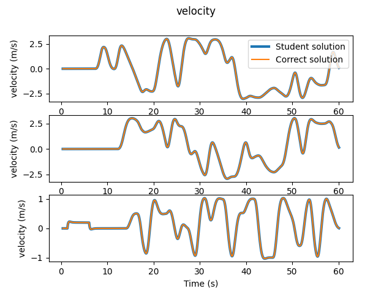
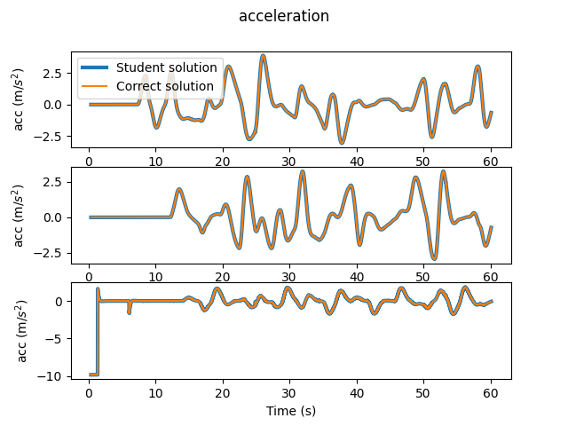
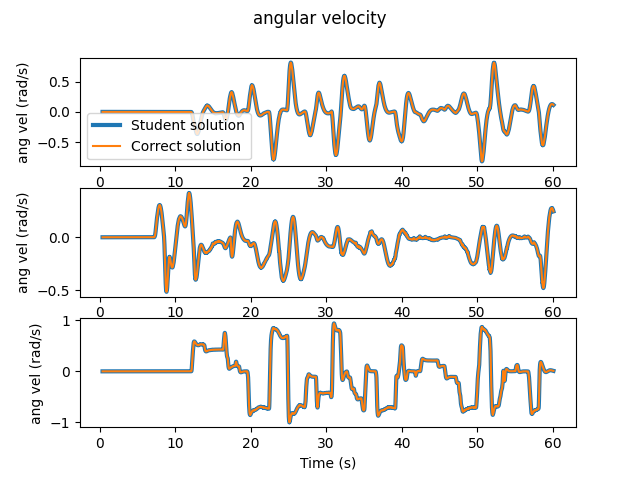
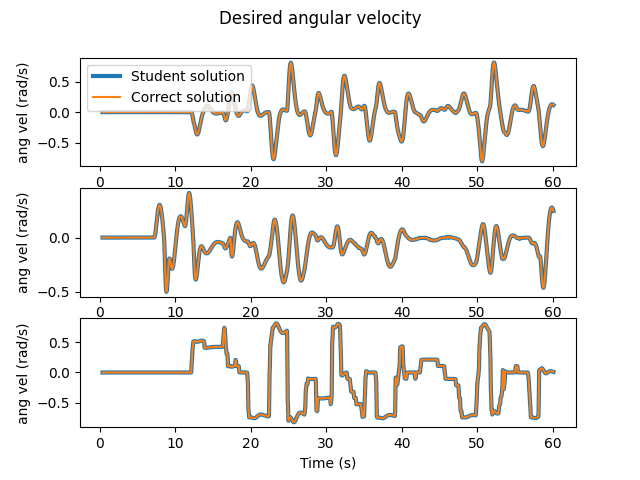

# 16-761 Assignment 1: Quadrotor Dynamics and Control (Total: 100 points)

Goals: In this assignment, you will implement the mathematical model
of a quadrotor's dynamics as well as a position and attitude
controller to track simple trajectories.

### Academic Integrity
1. Do not publicly share your solution (using GitHub or otherwise)
2. Collaboration is encouraged but you should write final code on your own.
3. No AI tools may be used to complete this assignment. This includes
but is not limited to Copilot, ChatGPT, Perplexity AI, and Cursor AI.

## 0. Setup
Create a python virtual environment.
```python
python3.8 -m venv .venv
```
Source the environment
```python
source .venv/bin/activate
```
You will need to install the following dependencies.
```python
pip install scipy pyyaml numpy matplotlib scikit-learn gdown
```
Download the assignment.
```bash
git clone git@github.com:mr-cmu/assignment1-handout.git
```
Note: if the above command results in a `Permission denied (public key)`
error, then try setting up an SSH key in your Github account using the
instructions [here](https://docs.github.com/en/authentication/connecting-to-github-with-ssh/adding-a-new-ssh-key-to-your-github-account).

If the cloning still does not work, use
```bash
git clone https://github.com/mr-cmu/assignment1-handout.git
```

Sample data is provided to check your answers. You may download
this data using the download script in the `data` directory.
```python
python download.py
```

**IMPORTANT:** Please replace the `utils` directory with your
solutions from assignment0. The functions you write in this assignment
depend on completion of the previous assignment.

## 1. Quadrotor Simulator (50 points)
The quadrotor simulator is contained in `quadrotor_simulator_py`. You
will implement functions in this folder, zip your folder, and upload
to Autolab for grading.

Test data and expected solutions are available for local testing.

To receive full credit on this portion of the assignment,
you will need to implement the following functions:

* `construct_mixer` (5 points)
* `calculate_force_and_torque_from_rpm` (5 points)
* `calculate_quadrotor_derivative` (5 points)
* `calculate_world_frame_linear_acceleration` (5 points)
* `calculate_angular_acceleration` (5 points)
* `ode_step` (25 points)

There are local tests provided for the functions described in 1.2 --
1.6 in `test/test_quadrotor_simulator.py`.

### 1.1 `construct_mixer` (5 points)
This function implements the mixer matrix as described in the lecture
slides. There is no local test for this function. To check your results,
you will need to upload your function to AutoLab.

### 1.2 `calculate_force_and_torque_from_rpm` (5 points)
This function calculates the scalar force and 3x1 torque vector from a
vector of 4 RPM values using the motor model discussed in class.

### 1.3 `quaternion_derivative` (5 points)
This function calculates the derivative of the quaternion using the
formula covered in the slides.

### 1.4 `calculate_world_frame_linear_acceleration` (5 points)
In this function you will implement Equation (4.2) from [1].

### 1.5 `calculate_angular_acceleration` (5 points)
In this function you will implement Equation (4.3) from [1].

### 1.6 `ode_step` (25 points)
This function implements the equations of motion for the quadrotor
dynamics model. The ODE solver is used to integrate the equations over
a period of time. The functions (1.1 -- 1.5) will be called within
this function.

In this function, you will need to implement the following:
* convert commanded RPMs (coming from the controller) to desired force and torques (see 1.2)
* calculate the angular acceleration (see 1.3)
* calculate the linear acceleration (see 1.4)
* calculate the derivative of the quaternion using the lecture notes. (see 1.2)
* calculate the achieved RPMs

To locally test your results, you can use the `test_ode_step`
function, which is located in `test_quadrotor_simulator.py`. If your
results are correct, you should see the following output.







## 2. Position Controller (30 points)
You will need to write the following functions:

* `compute_body_z_accel` (5 points)
* `compute_hod_refs` (5 points)
* `compute_orientation` (5 points)
* `compute_command` (15 points)

Detailed instructions for the contents of each function follow. There
are local tests provided for each function in
`test/test_position_controller.py`.

### 2.1 `compute_body_z_accel` (5 points)
This function uses the desired acceleration and current rotation to
calculate the body frame z acceleration.  See page 20 of [1] for
implementation details.

The lecture slides on quadrotor control also discuss how to implement
this function.

### 2.2 `compute_orientation` (5 points)
This function calculates the desired orientation.  Use Equations (33)
-- (36) from [3] to implement this function.

The lecture slides on quadrotor control also discuss how to implement
this function in detail.

### 2.3 `compute_hod_refs` (5 points)
This function uses the desired acceleration vector, flat reference,
and desired rotation to calculate the desired angular velocities and
accelerations.  Use Equations (14)--(25) of [2] to calculate the
angular velocities.  Use Equation (103)--(105) of [3] to calculate the
angular velocities. Disregard the drag component (i.e., set it to
zero) to make your life easier.

The lecture slides on quadrotor control also discuss how to implement
this function in detail.

### 2.4 `compute_command` (15 points)
This function contains the following functionality:
1. computes the PD feedback-control terms from the position and
   velocity control errors via Equation (32) of [2]
2. computes the desired rotation `compute_orientation`
3. applies the thrust command to the current body frame `compute_body_z_accel`
4. calculates the desired angular velocities and accelerations, which will
   be used in the inner control loop (detailed in the next section)





## 3. Attitude Controller (20 points)
You will need to write the following functions:

* `wrench_to_rotor_forces` (5 points)
* `force_to_rpm` (5 points)
* `run_ctrl` (10 points)

There are local tests provided for each function in
`test/test_attitude_controller.py`.

### 3.1 `wrench_to_rotor_forces` (5 points)
Uses the inverse of the mixer matrix to calculate rotor forces from
the thrust and torques.

### 3.2 `force_to_rpm` (5 points)
Uses the forces to calculates the RPMs using the thrust coefficients
and the quadratic formula.

### 3.3 `run_ctrl` (10 points)
This function contains the following functionality:

1. calculates the rotation error metric (see page 21 of [1])
2. calculates the PD control law discussed in the lecture slides
3. calculates the desired moments by pre-multiplying Equation 2.68 of
   [4] by the inertia matrix.
4. calculates the rotor forces using the `wrench_to_rotor_forces` function
5. calculates rpms from the rotor forces using the `force_to_rpm` function
6. calculates saturated rpms and returns


## 4. Grading with AutoLab
To have your solutions graded, you will need to tar the `quadrotor_simulator_py`
folder and upload to autolab.

```
cd assignment1-handout
tar -cvf handin.tar quadrotor_simulator_py
```

Autolab will run tests on each function you implement and you will
receive a score out of 100.  You may upload as many times as you like.
Note that we may regrade submissions after the deadline passes.

## 6. Visualization with ROS2
If you would like to visualize your solution with ROS2, follow the steps
[here](https://github.com/mral-cmu/quadrotor_simulator_ws#readme).

## References
[1] D. W. Mellinger, "Trajectory Generation and Control for Quadrotors" (2012). Publicly Accessible Penn Dissertations. 547. [https://repository.upenn.edu/edissertations/547](https://repository.upenn.edu/edissertations/547).

[2] M. Faessler, A. Franchi, and D. Scaramuzza, "Differential Flatness of Quadrotor Dynamics Subject to Rotor Drag for Accurate Tracking of High-Speed Trajectories." [https://rpg.ifi.uzh.ch/docs/RAL18_Faessler.pdf](https://rpg.ifi.uzh.ch/docs/RAL18_Faessler.pdf)

[3] M. Faessler, A. Franchi, and D. Scaramuzza, "Detailed Derivations of ``Differential Flatness of Quadrotor Dynamics Subject to Rotor Drag for Accurate Tracking of High-Speed Trajectories''". [https://rpg.ifi.uzh.ch/docs/RAL18_Faessler.pdf](https://rpg.ifi.uzh.ch/docs/RAL18_Faessler.pdf)

[4] A. Spitzer, "Dynamical Model Learning and Inversion for Aggressive Quadrotor Flight". CMU-RI-TR-22-03. [https://www.ri.cmu.edu/app/uploads/2022/01/aspitzer_phd_ri_2022.pdf](https://www.ri.cmu.edu/app/uploads/2022/01/aspitzer_phd_ri_2022.pdf)
